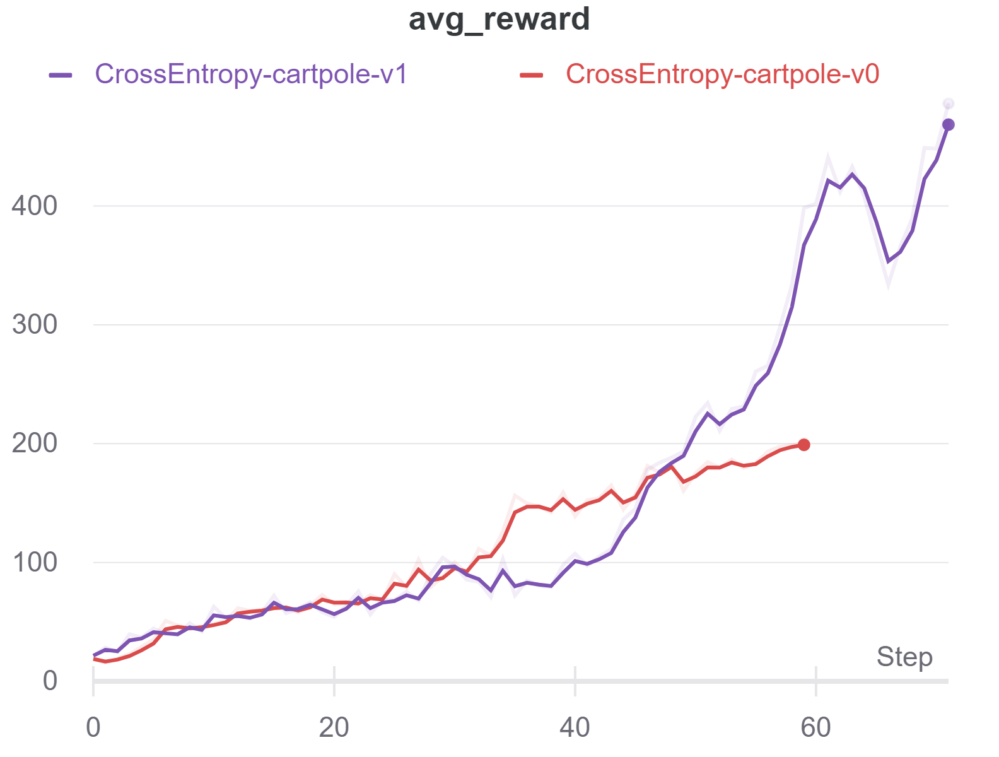

# Different methods of Rl for solving Cartpole-V0 & Cartpole-V1

## Results for CrossEntropy as a model-free, policy-based, and on-policy method

  

<a href="https://wandb.ai/iamjalipo/cartpole/reports/Project-Dashboard--Vmlldzo2MTczMzg/edit?flasher=&template=dashboard">Visit W3Schools.com!</a>

