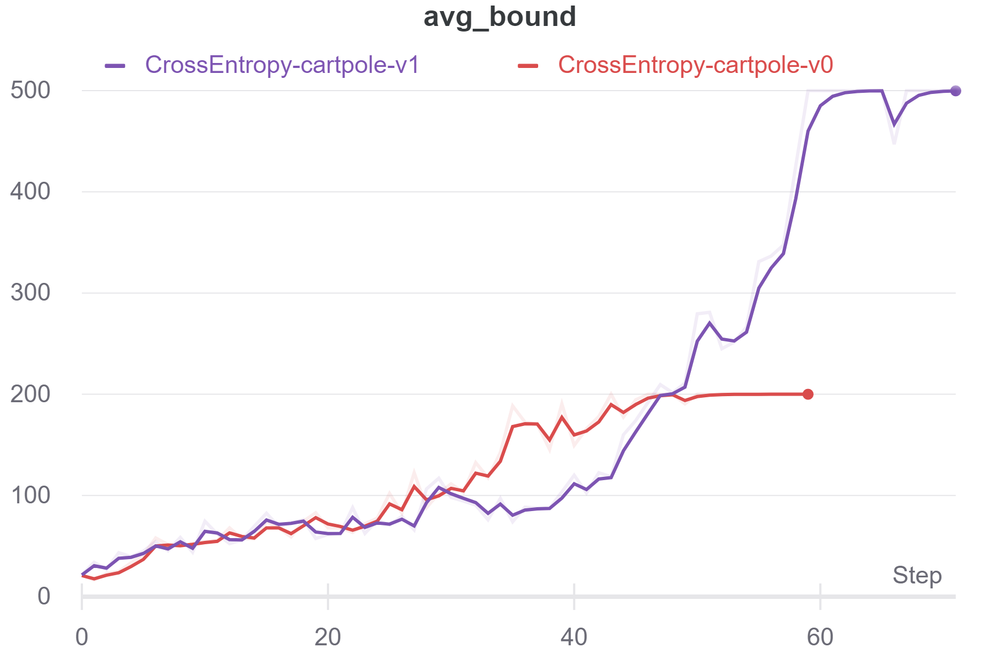
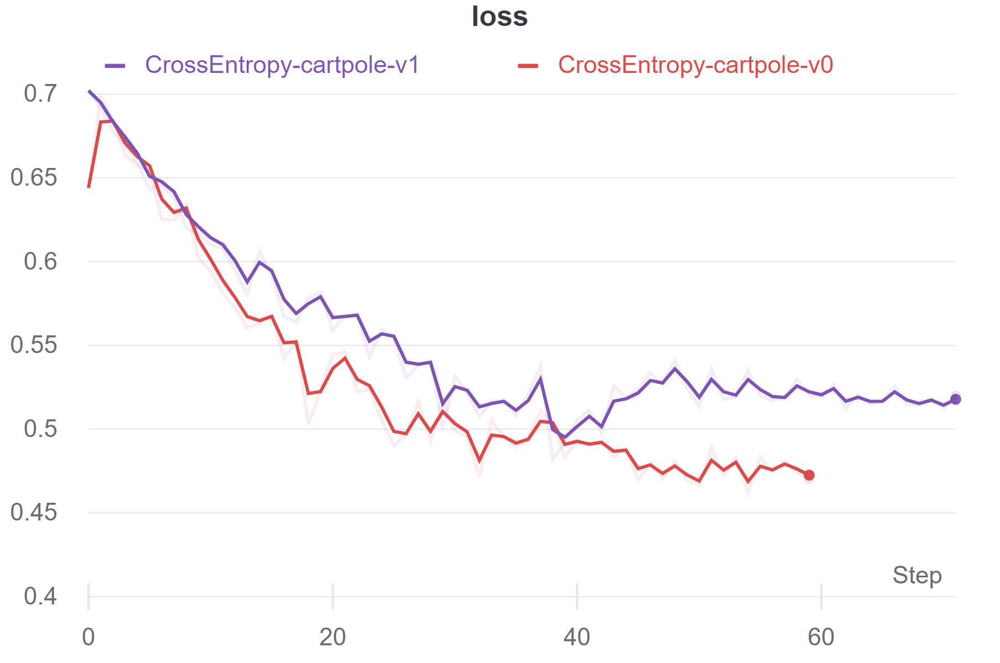
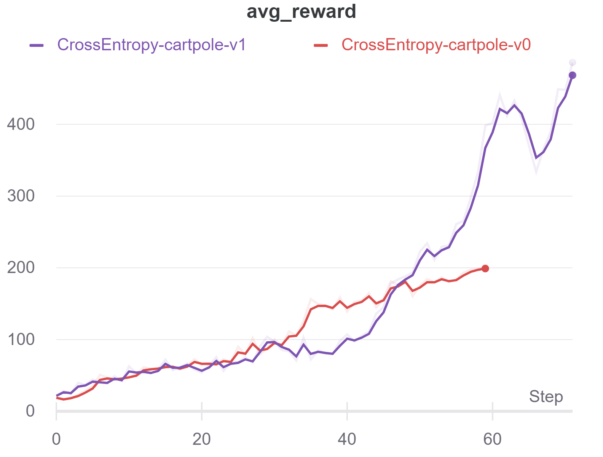

# Different methods of Rl for solving Cartpole-V0 & Cartpole-V1

## --CrossEntropy Results
## model-free, policy-based, and on-policy method

 

#### when the accumulated rewards reach the desired point the environment terminates
####  the desire point for CartpoleV0 is equal to 200 and for Cartpole-V1 is 500

<a href="https://wandb.ai/iamjalipo/cartpole/reports/Project-Dashboard--Vmlldzo2MTczMzg/edit?flasher=&template=dashboard">Visit W3Schools.com!</a>

